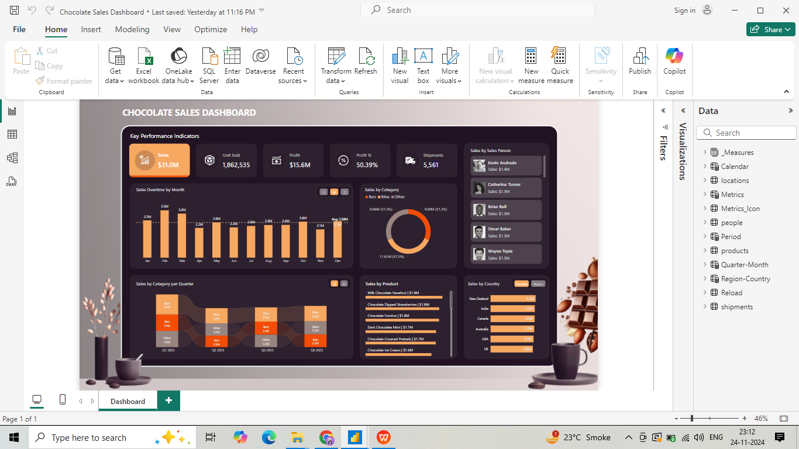

# Chocolate Sales Dashboard

A business intelligence dashboard built with Microsoft Power BI to analyze and visualize chocolate sales performance across regions, products, and time periods.



---

## Overview

This project presents an interactive sales analytics dashboard for a chocolate business, designed to help stakeholders make data-driven decisions by identifying top-performing products, sales trends, and regional performance at a glance.

---

## Dashboard Features

- **Sales Performance** — Track total revenue, units sold, and profit margins
- **Product Analysis** — Compare performance across different chocolate product lines
- **Regional Breakdown** — Visualize sales distribution across geographies
- **Time Series Trends** — Monthly and quarterly sales trend analysis
- **Top Performers** — Identify best-selling products and highest-revenue regions
- **Interactive Filters** — Slice data by date range, region, product category

---

## File Structure

```
Chocolate-Sales-Dashboard/
├── Chocolate Sales Dashboard.pbix   # Main Power BI dashboard file
├── chocolate.PNG                    # Dashboard screenshot preview
└── README.md                        # Project documentation
```

---

## How to Open

### Prerequisites
- [Microsoft Power BI Desktop](https://powerbi.microsoft.com/desktop/) — free to download

### Steps
1. Clone or download this repository
   ```bash
   git clone https://github.com/Rush-28/Chocolate-Sales-Dashboard.git
   ```
2. Open **Power BI Desktop**
3. Click **File → Open report → Browse**
4. Select `Chocolate Sales Dashboard.pbix`
5. The dashboard loads with all visuals and data intact

---

## Key Insights from the Dashboard

- Identified top 3 revenue-generating product lines
- Highlighted regions with highest and lowest sales performance
- Revealed seasonal sales patterns and peak demand periods
- Tracked month-over-month growth trends

> *Update this section with your actual findings from the dashboard*

---

## Tech Stack

| Tool | Purpose |
|---|---|
| Microsoft Power BI | Dashboard creation and data visualization |
| DAX | Calculated measures and KPIs |
| Power Query | Data transformation and cleaning |

---

## Skills Demonstrated

- Data visualization and dashboard design
- Business intelligence reporting
- DAX measures and calculated columns
- Data storytelling for non-technical stakeholders
- Sales data analysis and KPI tracking

---

## Screenshots

| Dashboard View |
|---|
|  |

---

## Author

**Rush-28**
[GitHub Profile](https://github.com/Rush-28)

---

## License

This project is open source and available under the [MIT License](LICENSE).
